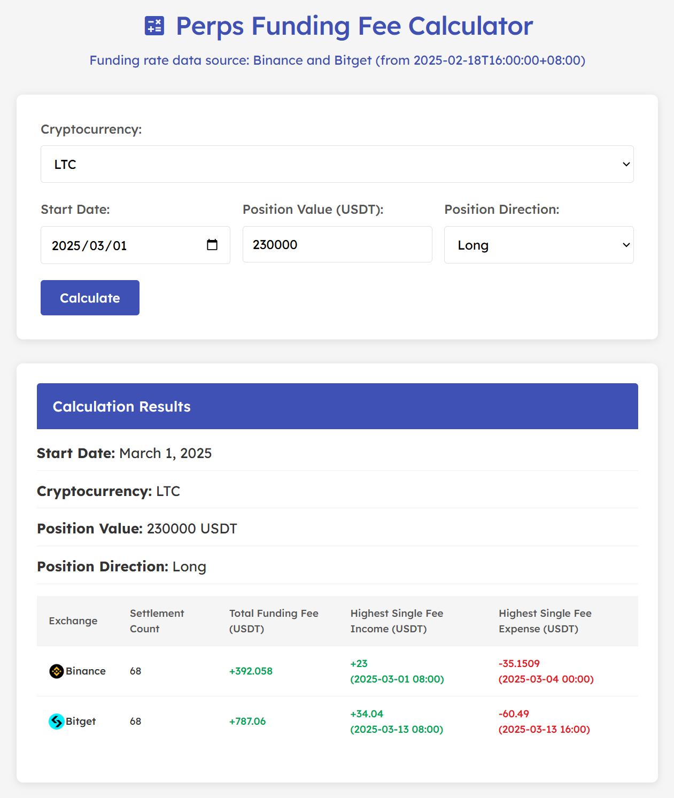

# Perps Funding Fee Calculator([link](https://btxlithium.github.io/perps-funding-fee-calculator/))
 



## Project Description

This web app is designed to help traders calculate their funding fee costs or income over a specified period on Bitget or Binance.

## Automated Updates

The funding rate data is automatically updated daily at 22:00 (UTC+8) using GitHub Actions. The workflow:
1. Retrieves the latest funding rates from Binance and Bitget APIs
2. Adds only new data to the existing JSON files
3. Commits and pushes the changes back to the repository

## Structure

```
perps-funding-fee-calculator/
├ index.html                  
├ style.css                   
├ script.js                   # Logic for calculations
├ update_funding_rates_binance.py  # Script to update Binance funding rates data
├ update_funding_rates_bitget.py   # Script to update Bitget funding rates data
├ assets/                     
├ data/                       # Historical funding rate data
└ .github/
  └ workflows/              # GitHub Actions workflows
    └ daily_funding_rates_update.yml  # Automated update workflow (runs daily at 22:00 UTC+8)
```

NOTE: `fetch_funding_rates_binance.py` and `fetch_funding_rates_bitget.py` are one-time scripts executed to fetch all historical funding rate data since February 18. 


## Donations

If you'd like to support my work, consider buy me a coffee:

- USDT or USDC Aptos:  
0x675422152a1dcb2eba3011a5f2901d9756ca7be872db10caa3a4dd7f25482e8e  
- USDT or USDC BNB Smart Chain:  
0xbe9c806a872c826fb817f8086aafa26a6104afac  